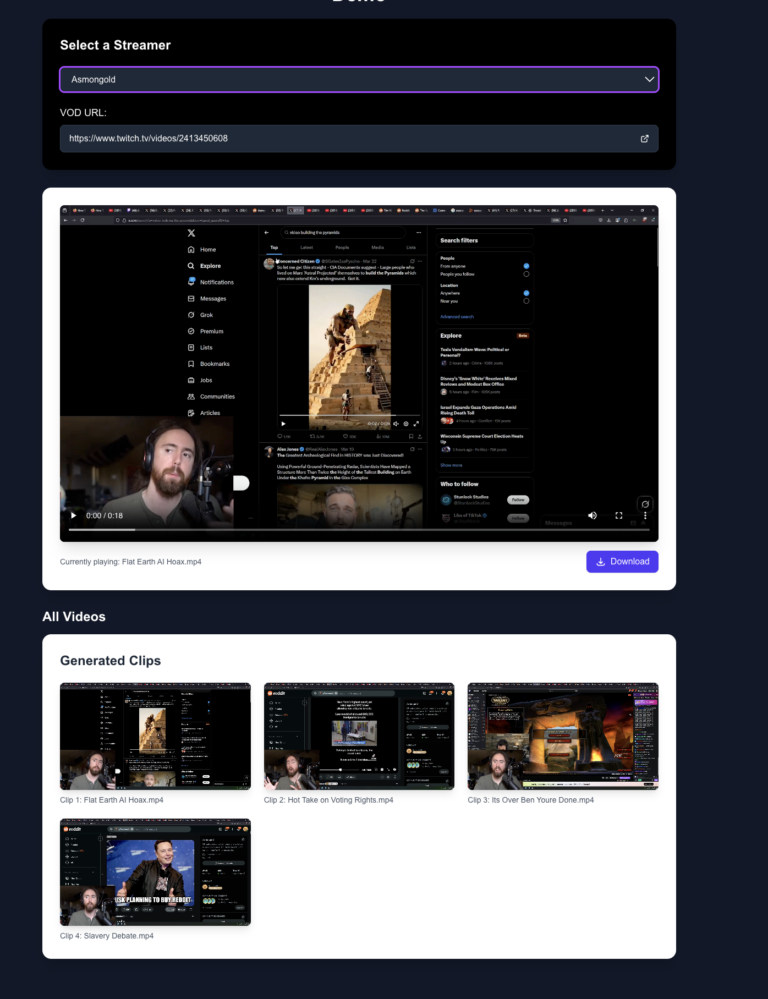

Welcome to clipception! Clipception allows you to find the most viral clips on your stream. This repo includes the flask app config (with celery) as well as the command line steps. 

*NOTE: The entire process varies in the amount of ⏰. For a VOD in 1080p that is 4 hours or more it will take roughly 30 minutes for the process to complete

<p align="center">
  
</p>

# 🎥 Clipception: Video Clip Extractor


## 🔗 Links
- **Web App**: [clipception.xyz](https://clipception.xyz)
- **Twitch**: [twitch.tv/krystal_mess323](https://www.twitch.tv/krystal_mess323)
- **YouTube**: [youtube.com/@krystal_mess323](https://www.youtube.com/@krystal_mess323)

## 📺 In Action

<p align="center">
  
</p>

## 🚀 Quick Start

1. Create a conda environment with Python 3.10 or later:
   ```bash
   conda create -n your_env_name python=3.10
   conda activate your_env_name
   ```

2. Set API key:
   ```bash
   export OPEN_ROUTER_KEY='your_key_here'
   ```

3. Install dependencies:
   ```bash
   pip install -r requirements.txt
   ```

4. Run:
   ```bash
   python process_video_v3.py url_for_twitch_vod
   ```


## 🔍 Features

- 🎯 AI-powered clip selection
- 🔊 Advanced audio analysis
- 💪 GPU acceleration
- 📊 Engagement metrics
- 🎬 Automated extraction using subprocess for improved reliability

## 📦 Output

Files are organized in `FeatureTranscribe/`:
- `[video].enhanced_transcription.json` - Transcription with audio features
- `top_clips_one.json` - Ranked clips
- `clips/` - Extracted video segments


